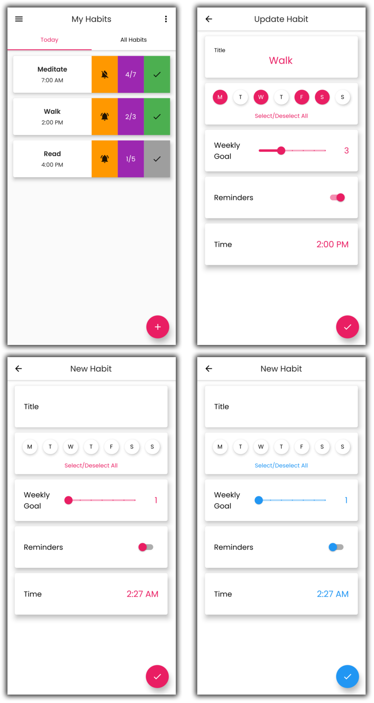

# simple-habits

A Habit tracker app made with Flutter. Optimized for Android only for now.

## Description

The app lets you create habits, set weekly goals, and track daily progress. It is a very simple idea but it's not meant to
be the most practical. I worked on this project to learn Flutter and showcase my skills. Most ToDo apps are very basic looking so I tried to make
mine more refined with a modern minimalistic UI.

## Development

Made with Flutter. Designed everything myself. Used SQFlite to store user data. Could've tried Firebase but I didn't think it was necessary
for now with this level of data. Used Bloc and setState() for state management. This is my first time
working with state management so that part is a bit messy. If the app gets downloads, then I will implement Firebase and optimize the state management. Used VS Code as editor and tested on Android Emulators and personal device.

## Screenshots

